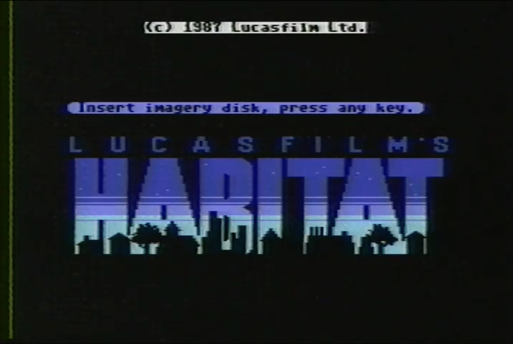
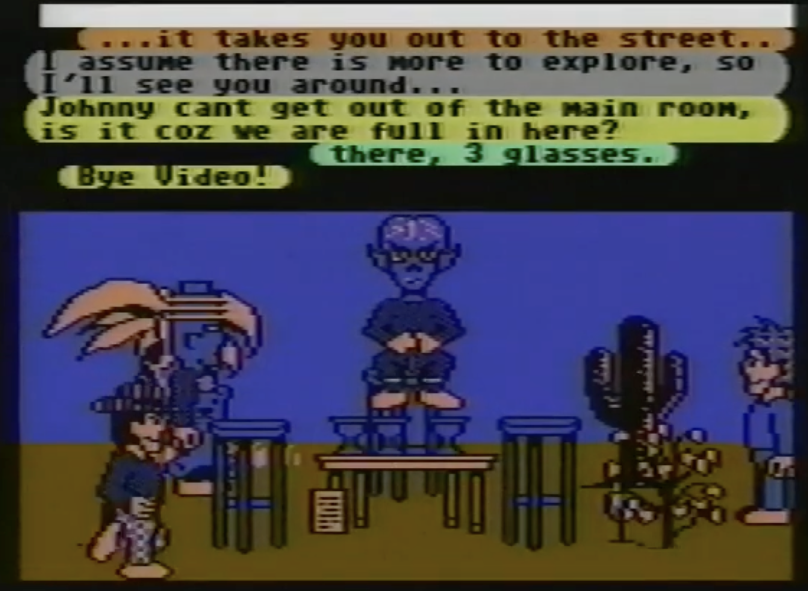
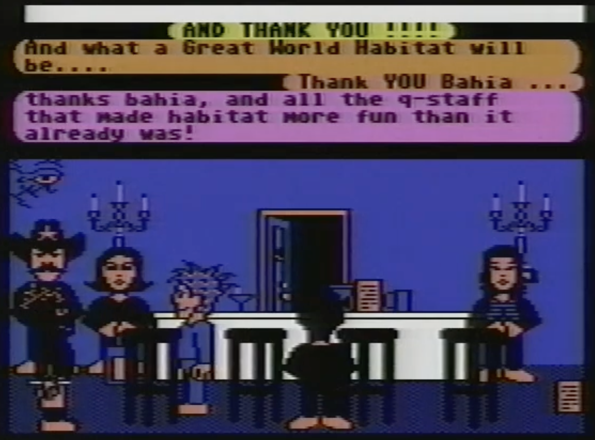

# Habitat Avatar Simulator

**Explore every avatar customization from the first graphical virtual world.**

  
  
  

## Why this tool exists

Lucasfilm's **Habitat** (1986) was the first graphical multiplayer virtual world — and the first game to call its player characters *avatars*.[1](#fn1) Built for the Commodore 64 and Quantum Link (the network that became AOL), it let thousands of players inhabit a shared, persistent world where they could talk, trade, start businesses, get married, wage wars, and govern themselves.

Avatar customization was central to the experience. Players could change their clothing patterns using spray-on body color cans, adjust their height, and — most importantly — collect **heads**. Over 160 different heads existed in the game, sold through in-game vending machines (Vendroids) for Tokens, the virtual currency. Heads became collectibles, status symbols, and objects of trade, prefiguring the cosmetic economies that drive modern games.

Despite a working [NeoHabitat](https://neohabitat.org) server revival and playable clients for [web](https://v.ht/habitat), Mac, and Windows, the original avatar art has remained locked inside C64-specific binary formats — 2-bit palette data with orientation flags, run-length compression, and column-major pixel ordering. **No one had extracted and reassembled the complete avatar system** in a way that lets you see all the possibilities at once.

This simulator does exactly that. It decodes the original `Avatar.bin` body data and all 160+ head `.m` source files, then runs the C64 rendering pipeline — limb chaining, view-specific draw order, clothing patterns, animated heads — entirely in the browser. You can browse every head, try every pose, apply any of the 16 clothing patterns, and switch between side, front, and back views.

## What the game actually did

In Habitat, you couldn't just pick any head from a menu. The economy drove customization:

- **Heads** were purchased from Vendroids (vending machines) scattered across the world, each costing Tokens. Some rare heads could only be earned through quests or special events. To change heads, your avatar had to physically bend down, remove the current head, place it on the ground, pick up the new one, and put it on — a ritual that other players could watch (and occasionally interfere with).

- **Clothing patterns** came from **spray-on body color** cans — small aerosol objects that each contained one of 16 dither patterns. You pointed the spray at a body zone (torso, arms, or legs) and activated it to change that zone's pattern. The 16 patterns ranged from solid fills to checkerboards, stripes, and sparse dots, all rendered through the C64's multicolor bitmap mode.

- **Colors** were set per-avatar using three palette slots (clothing, outline, and skin/highlights), shared between body and head. The C64's limited palette meant that every avatar was built from the same three-color constraint, but the combinations of head, pattern, and color created a surprisingly wide design space.

The [Avatar Handbook](https://frandallfarmer.github.io/neohabitat-doc/docs/Avatar%20Handbook.html), distributed to beta testers in 1987, documented all of this in detail.

## Tracing the genealogy of avatars

This tool is useful for anyone studying the history of avatars in social platforms and virtual worlds. Habitat established patterns that persist today:

- **Cosmetic identity as social currency** — rare heads conferred status, just as rare skins do in modern games
- **Embodied presence** — your avatar was your body in the world, not a profile picture
- **Constrained expressiveness** — a small set of poses (stand, walk, wave, point, bend) combined with head and clothing customization to create identity within tight technical limits
- **Virtual economies** — the first instance of players buying, selling, and trading cosmetic items

The word "avatar" had already appeared in gaming — Richard Garriott used it in *Ultima IV* (1985) — but as a diegetic title earned by the player character, not as a label for the player's representation itself. Habitat was the first to use it in the modern sense: every player character was an *avatar*, an embodiment of the person behind the screen. Chip Morningstar borrowed the term from Poul Anderson's space opera novel *The Avatar* (1978). Neal Stephenson's *Snow Crash* (1992) later cemented the word — and the concept of the *metaverse* — in popular culture.

## How it works

The simulator is a **purely static web application** — a single `index.html` file that runs entirely in the browser. No server logic, no dependencies, no build step.

The rendering pipeline is ported from the original C64 6502 assembly source code:

1. **Position chaining** (`find_cel_xy` from `mix.m`) — each limb's position is computed by chaining `x_rel`/`y_rel` offsets from the previous limb
2. **View-specific draw order** (`draw_a_limb` from `animate.m`) — limbs are layered differently for side, front, and back views
3. **Cel positioning** (`paint_1` from `paint.m`) — each sprite frame is placed using `x_offset`/`y_offset` from its 6-byte header, with horizontal flip for back view
4. **Pattern application** (`pick_pattern` / `cel_patterns` from `paint.m`) — blue pixels (C64 value `01`) are replaced with a 4-scanline repeating dither pattern
5. **Head rendering** (`draw_contained_object` from `mix.m`) — heads are drawn as contained objects at `cx_tab[4], cy_tab[4] - 63`, with per-head `disk_face` flags controlling the neck overlay

The offline Python scripts in `tools/` decode the original binary assets into PNG images and JSON manifests:
- `decode_avatar_bin.py` — decodes `Avatar.bin` (body limb cels)
- `habitat_renderer.py` — decodes head `.m` assembly source files
- `extract_head_data.py` — extracts per-head configuration (animation tables, view mappings, overlay flags)

## References

- **[Original C64 source code](https://github.com/Museum-of-Art-and-Digital-Entertainment/habitat)** — the 6502 assembly that this simulator ports
- **[NeoHabitat](https://github.com/frandallfarmer/neohabitat)** — open-source server revival, playable at [neohabitat.org](https://neohabitat.org)
- **[Play Habitat in your browser](https://v.ht/habitat)** — VICEjs web client connected to the NeoHabitat server
- **[The Avatar Handbook](https://frandallfarmer.github.io/neohabitat-doc/docs/Avatar%20Handbook.html)** — original 1987 player documentation
- **[The Lessons of Lucasfilm's Habitat](https://web.stanford.edu/class/history34q/readings/Virtual_Worlds/LucasacfilmHabitat.html)** — foundational paper by Morningstar & Farmer (1991)
- **[Habitat Chronicles](http://habitatchronicles.com/)** — ongoing historical documentation by the creators

## License

The original Habitat art assets and source code are property of their respective rights holders. This simulator is a research and preservation tool built for historical study.

---

<a id="fn1">1.</a> The word "avatar" was first applied to a game character in Richard Garriott's *Ultima IV: Quest of the Avatar* (1985), but there it is **diegetic** — a title the protagonist earns within the game's fiction after mastering the eight Virtues. In Habitat (1986), the term is used in the modern, **extra-diegetic** sense: every player character is called an avatar, meaning the player's embodied representation in a shared virtual world. It is this usage — later popularized by Neal Stephenson's *Snow Crash* (1992) — that became the standard meaning in computing. See [Avatar (computing)](https://en.wikipedia.org/wiki/Avatar_(computing)) on Wikipedia.

---

